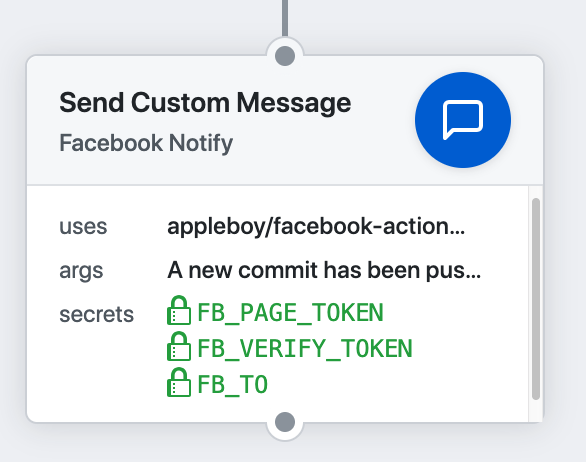
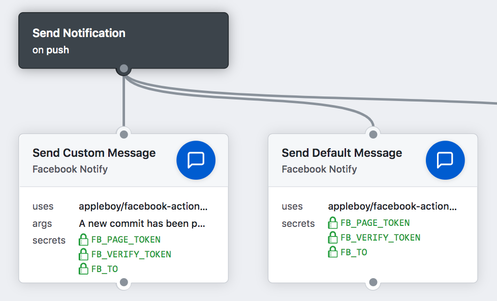

# 🚀 Facebook Notify for GitHub Actions

[GitHub Action](https://developer.github.com/actions/) for sending a Facebook notification message.



[](https://github.com/appleboy/facebook-action/actions)

## Usage

Send custom message and see the custom variable as blow.

```yml
name: facebook message
on: [push]
jobs:

  build:
    name: Build
    runs-on: ubuntu-latest
    steps:

    - name: send custom message
      uses: appleboy/facebook-action@master
      with:
        fb_page_token: ${{ secrets.FB_PAGE_TOKEN }}
        fb_verify_token: ${{ secrets.FB_VERIFY_TOKEN }}
        to: ${{ secrets.FB_TO }}
        args: The ${{ github.event_name }} event triggered first step.
```

Remove `args` to send the default message.

```yml
- name: send default message
  uses: appleboy/facebook-action@master
  with:
    fb_page_token: ${{ secrets.FB_PAGE_TOKEN }}
    fb_verify_token: ${{ secrets.FB_VERIFY_TOKEN }}
    to: ${{ secrets.FB_TO }}
```



## Input variables

Getting started with [Facebook Message Platform](https://developers.facebook.com/docs/messenger-platform/).

* fb_page_token: Token is the access token of the Facebook page to send messages from..
* fb_verify_token: The token used to verify facebook.
* to: Recipient is who the message was sent to (required).
* app_secret: The app secret from the facebook developer portal.
* verify: verifying webhooks on the Facebook Developer Portal.
* images - Optional. photo message
* audios - Optional. audio message
* videos - Optional. video message
* files - Optional. file message

### Example

```yml
- name: send gopher image message
  uses: appleboy/facebook-action@master
  with:
    fb_page_token: ${{ secrets.FB_PAGE_TOKEN }}
    fb_verify_token: ${{ secrets.FB_VERIFY_TOKEN }}
    to: ${{ secrets.FB_TO }}
    message: send photo message
    images: "https://golang.org/doc/gopher/gophercolor.png"
```

## Template variable

| Github Variable   | facebook Template Variable |
|-------------------|----------------------------|
| GITHUB_REPOSITORY | repo                       |
| GITHUB_ACTOR      | repo.namespace             |
| GITHUB_SHA        | commit.sha                 |
| GITHUB_REF        | commit.ref                 |
| GITHUB_WORKFLOW   | github.workflow            |
| GITHUB_ACTION     | github.action              |
| GITHUB_EVENT_NAME | github.event.name          |
| GITHUB_EVENT_PATH | github.event.path          |
| GITHUB_WORKSPACE  | github.workspace           |
